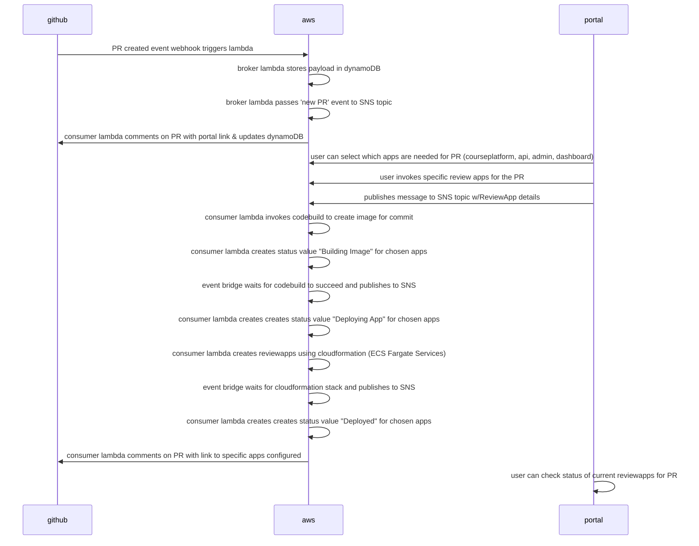

```mermaid
sequenceDiagram
    participant github
    participant aws
    participant portal
    github->>aws: PR created event webhook triggers lambda
    aws->>aws: broker lambda stores payload in dynamoDB
    aws->>aws: broker lambda passes 'new PR' event to SNS topic
    aws->>github: consumer lambda comments on PR with portal link & updates dynamoDB
    portal->>aws: user can select which apps are needed for PR (courseplatform, api, admin, dashboard)
    portal->>aws: user invokes specific review apps for the PR
    portal->>aws: publishes message to SNS topic w/ReviewApp details    
    aws->>aws: consumer lambda invokes codebuild to create image for commit
    aws->>aws: consumer lambda creates status value "Building Image" for chosen apps    
    aws->>aws: event bridge waits for codebuild to succeed and publishes to SNS 
    aws->>aws: consumer lambda creates creates status value "Deploying App" for chosen apps  
    aws->>aws: consumer lambda creates reviewapps using cloudformation (ECS Fargate Services)
    aws->>aws: event bridge waits for cloudformation stack and publishes to SNS
    aws->>aws: consumer lambda creates creates status value "Deployed" for chosen apps  
    aws->>github: consumer lambda comments on PR with link to specific apps configured
    portal->>portal: user can check status of current reviewapps for PR
```
